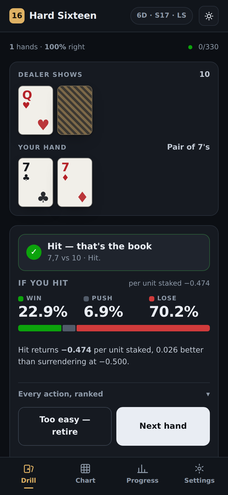
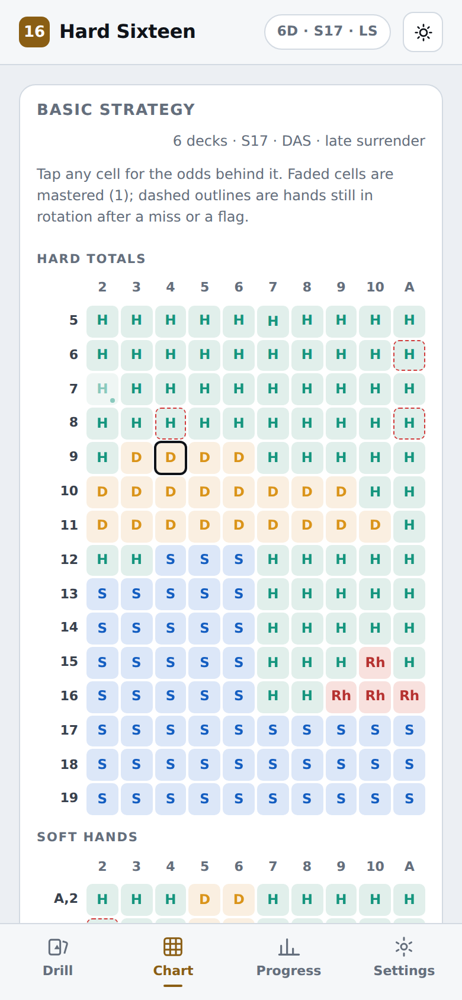
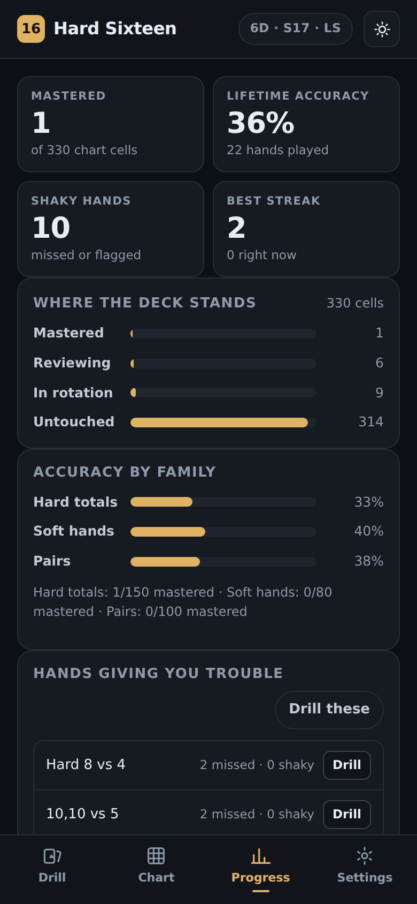

# Hard Sixteen

A blackjack basic-strategy trainer for your phone. It deals you a hand, you pick
an action, and it tells you what the book says along with the exact chance that
play wins, pushes or loses. Hands you keep getting wrong come back often; hands
you own get retired and never shown again.

No build step, no dependencies, no backend. It is a static page that works
offline once loaded.

| Drill | Chart | Progress |
| --- | --- | --- |
|  |  |  |

## What it does

**Drills the chart.** Every two-card decision a 4–8 deck chart covers: 15 hard
totals, 8 soft hands and 10 pairs against each of the 10 dealer upcards — 330
cells in all. The graded answer always comes from the printed chart, so what you
learn is what the book says.

**Shows the odds behind every play.** After you answer you get win / push / lose
for the book play, then the same three figures plus expected value for every
other action you could have taken, ranked. Tap any cell on the chart tab to see
the same breakdown without playing a hand.

**Remembers what you find hard.** Each cell is a spaced-repetition card:

| What you did | What happens |
| --- | --- |
| Right, confident | Interval grows. Three in a row and the hand retires for good. |
| Right, but you tapped **Not sure** | Stays in short rotation and comes back within a couple of hands. |
| Wrong | Back to the front of the queue. |
| **Too easy — retire** | Gone immediately, by hand. |

Hold an action button instead of tapping it to answer "not sure" in one gesture.
Peeking at the odds before you answer counts as not sure too.

The chart tab fills in as you go: mastered cells fade, cells still in rotation
after a miss get a dashed outline.

**Follows your table.** 4, 6 or 8 decks, dealer stands or hits soft 17, double
after split on or off, late surrender on or off. The chart, the buttons and the
odds all move together.

## Running it

Open `index.html` over HTTP (a `file://` URL will not register the service
worker):

```sh
python3 -m http.server 8080     # then visit http://localhost:8080
```

On GitHub Pages, point Pages at this branch's root and it works as-is.

**On a phone:** open the page in Safari or Chrome and add it to the home screen.
It then launches full screen and runs with no signal. Progress is kept in that
browser's local storage — Settings → Backup copies it out as JSON.

`dist/hard-sixteen.html` is the whole app inlined into one file. Save it
anywhere and open it; everything works except the service worker.

## How the odds are worked out

`src/engine/odds.js` solves each hand rather than simulating it.

- The cards on the table are removed from the shoe, and every later draw comes
  from that depleted shoe held fixed. At 4–8 decks this sits within a couple of
  hundredths of a percent of a full combinatorial solve and keeps a hand solvable
  in under a millisecond.
- The dealer's distribution is solved by recursion and conditioned on the peek,
  so the numbers are the ones you actually face once the dealer has checked for
  blackjack.
- The player's side is solved the same way, carrying a full payout distribution
  rather than just an average, which is where win / push / lose come from.
  Doubling scales the payouts; splitting convolves two independent hands.
- Resplits are not modelled, so a splittable pair is worth a hair more in a real
  game than the figure shown. Expected value is per unit of your original bet,
  which is why a double can read beyond ±1.

## Tests

```sh
npm test
```

102 checks across four files:

- **`test/odds.test.mjs`** — distributions sum to one; dealer bust rates match
  published tables for all ten upcards; the infinite-deck dealer tables for 6 and
  7 reproduce exactly; ten published expected values; and, end to end, perfect
  play over every opening deal returns **−0.38%**, against a published house edge
  of 0.40% for these rules.
- **`test/strategy.test.mjs`** — every one of the 340 chart cells, in both S17 and
  H17, is compared against what the odds engine computes for the hands that row
  covers, weighted by how often the shoe deals them. **All 680 agree.**
- **`test/srs.test.mjs`** — retirement, low-confidence rotation, miss handling,
  and a 4000-hand simulation of a learner who is shaky on hard 15 and 16: the
  shaky cells come back 50× more often than settled ones, none of them retires,
  and all 310 others do.
- **`test/ui.test.mjs`** — drives the built page in Chromium: plays hands, checks
  the odds add to 100%, walks every tab, flips the rules and confirms the chart
  moves, verifies progress survives a reload, and checks for horizontal overflow
  at 360px and 900px.

## Layout

```
index.html              app shell and markup
src/styles.css          tokens and components, light and dark
src/engine/
  rules.js              table rules and presets
  cards.js              hand totals, soft/hard, display cards
  odds.js               the solver
  strategy.js           the S17 and H17 charts
  scenarios.js          the 330 drillable cells
  srs.js                the scheduler
src/app/
  store.js              local storage, export and import
  format.js             number and bar formatting
  main.js               views and wiring
tools/bundle.mjs        inlines everything into dist/
tools/make-icons.mjs    renders the PNG icons from icon.svg
```

## Colour

The five action colours are checked, not chosen by eye: they clear the
colour-vision separation and normal-vision gates on every pair in both themes,
against this app's own surfaces. Every cell also carries its letter, so colour is
never the only channel. Win / push / lose use fixed status colours with a neutral
midpoint rather than green-against-red.
